# Лабораторная работа 3

## Подготовка

1. Создаём виртуальные машины A, B и C. (Машина A - chikirao, B - vboxuser с фиолетовым фоном терминала, C - vboxuser с зеленым фоном.)

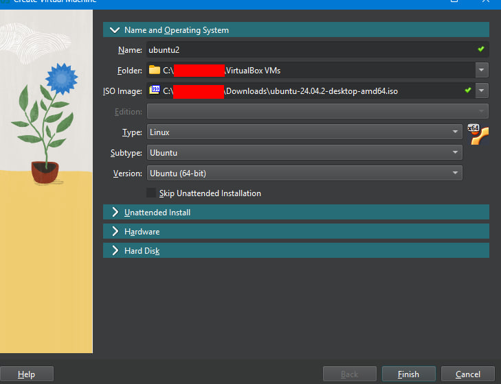

2. Настраиваем и проверяем доступ в интернет машине A. Доступ в интернет есть.

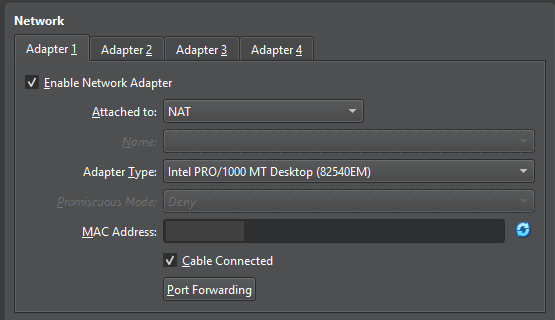

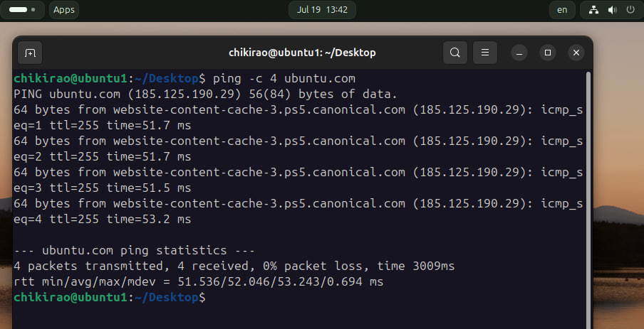

## Доступ AB

3. Создаём машине A второй адаптер, внутреннюю сеть для подключения к машине B, имя `AB`.

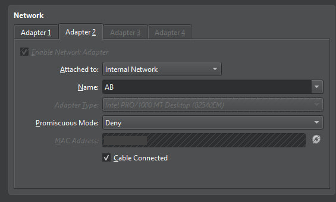

4. Для машины A настраиваем статический адрес, для этого модифицируем файл `50-cloud-init.yaml`, отключаем DHCP, статический адрес ставим 10.0.0.1/24. epn0s3 отвечает за подключение машины к интернету, а epn0s8 для сети с машиной B.

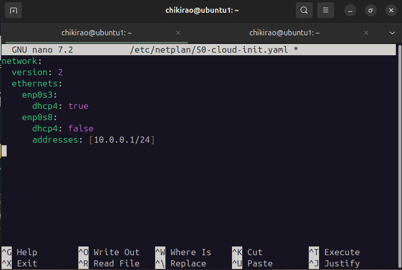

5. Применяем изменения и проверяем назначен ли адрес.

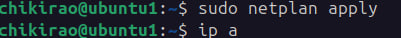

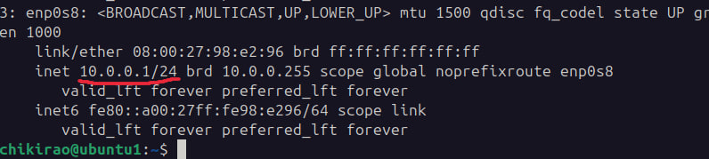

6. Машине B настраиваем единственный адаптер - внутреннюю сеть с машиной A, `AB`.

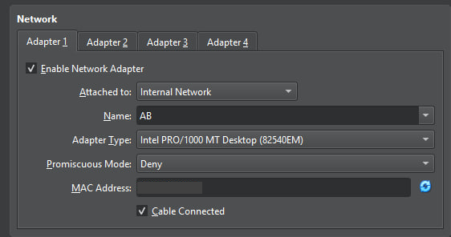

7. Статический адрес машине B устонавливаем 10.0.0.2/24. Применяем изменения и проверяем.

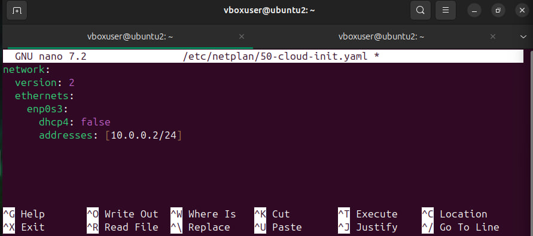

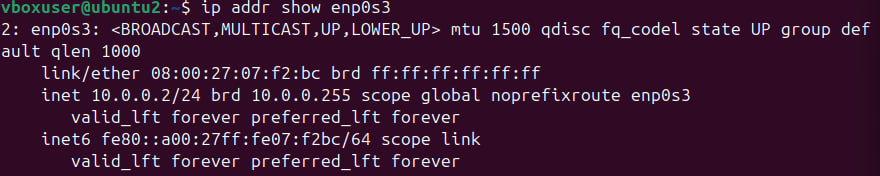

8. Запускаем обе машины и пингуем друг-друга, работает, связь `AB` есть.

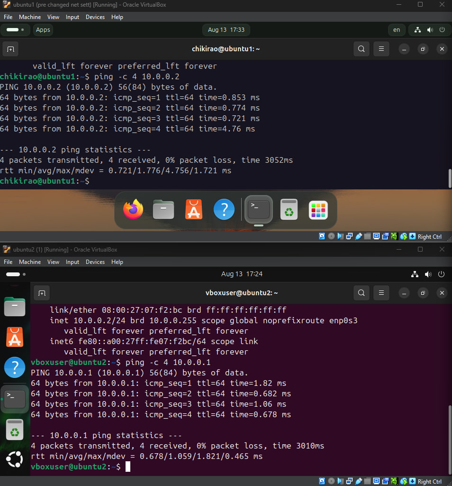

## Доступ AC

9. Машине A создаем третий адаптер - AC.

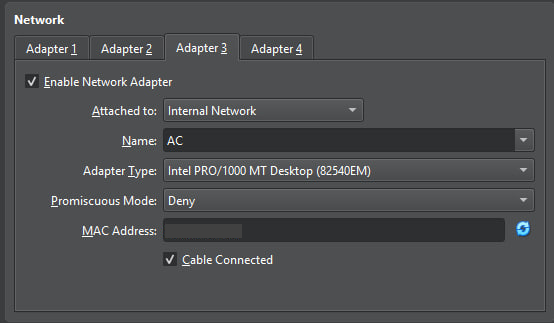

10. Машине C единственным адаптером делаем внутреннюю сеть AC.

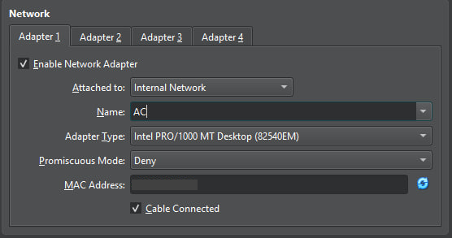

11. У машины А новому интерфейсу enp0s9 задаём статический адрес 10.0.1.1/24.

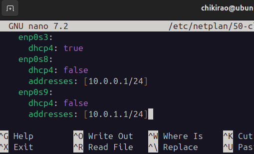

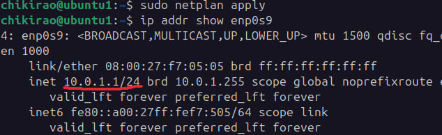

12. Машине C - 10.0.1.2/24.

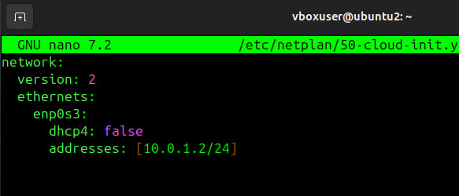

13. Проверяем подключение AC. Работает.

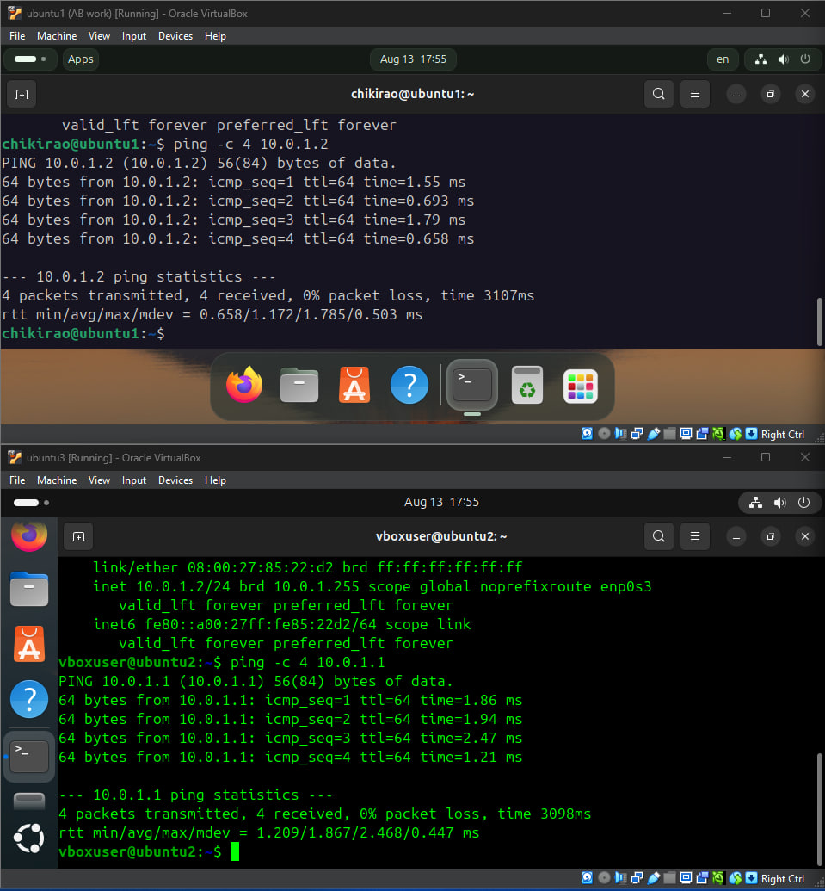

## Проверяем доступы машин A, B, C.

14. АВ есть. АС есть. ВА есть. ВС нет. СА есть. СВ нет.

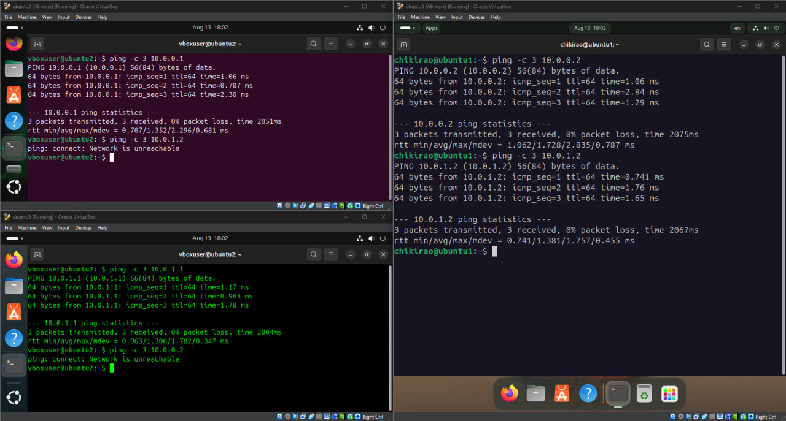

Готово.